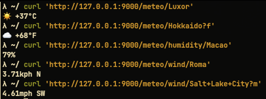

# Meteo 🌦 
**Meteo** is a HTTP weather forecast service that allows you to display weather conditions directly on your terminal or on the
`tmux` status bar. This service is written in Python using Flask and relies on 
[OpenWeatherMap](https://openweathermap.org) to retrieve meteorological data.



## Usage
As an HTTP service, **Meteo** can be queried through any HTTP client, for example by using your browser or `cURL`. 
To retrieve the weather conditions of your city, send a `GET` request to the following endpoint specifying the city
in the URL. For example:

```sh
$> curl 'http://127.0.0.1:9000/api/Rome'
☀️  +35°C
```

The service will yield an emoji(representing the current weather conditions) and the temperature formatted using
the metric system. To format the temperature using the imperial system, you can append the `f` parameter to the URL.
That is:

```sh
$> curl 'http://127.0.0.1:9000/api/Rome?f'
☀️  +95°F
```

If your city consists on two or more words, you can format the URL as follows:
```sh
$> curl 'http://127.0.0.1:9000/api/Buenos+Aires'
```

## Cache
To minimize the amount of calls to the OpenWeatherMap servers, **Meteo** stores the weather data in a
built-in, in-memory cache data structure. Each time a client requests the weather of a given location, **Meteo**
tries to search it first on the cache; if it is found, the cached value is returned otherwise a new API call is
performed and the retrieved value is inserted in the cache before being returned to the client. The expiration time, expressed
in hours, is controlled by setting an environment variable(`METEO_CACHE_TTL`). After a cached value 
is expired, **Meteo** must retrieve it directly from OpenWeatherMap servers.

You can disable the cache by setting the `METEO_CACHE_TTL` variable to any non-positive value.

The cache system significantly improves **Meteo** performance by decreasing its latency, furthermore
it allows to reduce the amount of API calls per day(which is quite important if you are using the OpenWeatherMap free tier).

## Configuration
Before deploying the service, you must configure the following properties:

| Variable               | Meaning                                |
|------------------------|----------------------------------------|
| `METEO_LISTEN_ADDRESS` | Listen address                         |
| `METEO_LISTEN_PORT`    | Listen port                            |
| `METEO_TOKEN`          | OpenWeatherMap API key                 |
| `METEO_CACHE_TTL`      | Cache time-to-live(expressed in hours) |

Each value must be set _before_ launching the application by exporting them as environment variable. If you plan to 
deploy the service using Docker, you can specify the previous variables by editing the `compose.yml`
file, otherwise you can manually export them(i.e., `export METEO_LISTEN_ADDRESS='127.0.0.1'`).

In order to use this service, you will also need an OpenWeatherMap API key. You can get one by following the
instructions [on their website](https://openweathermap.org/api).

## Deploy
The easiest way to deploy **Meteo** is by using Docker. In order to launch it, issue the following command:
```sh
$> docker compose up -d
```
This will build the container image and then launch it. By default the service will be available on `127.0.0.1:9000`
but you can easily change this property by modifying the associated environment variable(see section above).

## License
This software is released under the GPLv3 license. You can find a copy of the license with this repository 
or by visiting the [following page](https://choosealicense.com/licenses/gpl-3.0/).
